# 02 — Database relationships

Solid arrows are declared FKs; dashed arrows are logical naming-based relationships.

```mermaid
flowchart LR
  candidates -->|replaced_by_candidate_id CONFIRMED| candidates
  categories -->|parent_id CONFIRMED| categories
  data_rows -->|data_type_id CONFIRMED| data_types
  menu_items -->|menu_id CONFIRMED| menus
  permission_role -->|permission_id CONFIRMED| permissions
  permission_role -->|role_id CONFIRMED| roles
  users -->|role_id CONFIRMED| roles
  user_roles -->|role_id CONFIRMED| roles
  user_roles -->|user_id CONFIRMED| users
  agenciers -.->|country_id INFERRED| countries
  agencies -.->|candidate_id INFERRED| candidates
  announcements -.->|group_id INFERRED| class_groups
  announcement_class_groups -.->|announcement_id INFERRED| announcements
  announcement_class_groups -.->|class_group_id INFERRED| class_groups
  arcs -.->|candidate_id INFERRED| candidates
  attribute_list -.->|user_id INFERRED| users
  candidates -.->|agent_id INFERRED| agents
  candidates -.->|class_group_id INFERRED| class_groups
  candidates -.->|companier_id INFERRED| companiers
  candidates -.->|agencier_id INFERRED| agenciers
  candidates -.->|position_id INFERRED| positions
  candidates -.->|sub_agent_id INFERRED| sub_agents
  candidates -.->|country_id INFERRED| countries
  candidate_documents -.->|candidate_id INFERRED| candidates
  candidate_documents -.->|document_type_id INFERRED| document_types
  class_schedules -.->|teacher_id INFERRED| teachers
  class_schedules -.->|class_group_id INFERRED| class_groups
  companiers -.->|country_id INFERRED| countries
  companies -.->|candidate_id INFERRED| candidates
  curricular_list -.->|user_id INFERRED| users
  districts -.->|division_id INFERRED| divisions
  educations -.->|user_id INFERRED| users
  employer_candidates -.->|employer_id INFERRED| employers
  employer_candidates -.->|candidate_id INFERRED| candidates
  exams -.->|class_group_id INFERRED| class_groups
  exam_results -.->|exam_id INFERRED| exams
  exam_results -.->|candidate_id INFERRED| candidates
  exam_results -.->|class_group_id INFERRED| class_groups
  experiences -.->|user_id INFERRED| users
  experiences -.->|country_id INFERRED| countries
  expertise_list -.->|user_id INFERRED| users
  flight_schedules -.->|candidate_id INFERRED| candidates
  interest_list -.->|user_id INFERRED| users
  invoices -.->|companier_id INFERRED| companiers
  invoices -.->|country_id INFERRED| countries
  invoice_candidates -.->|invoice_id INFERRED| invoices
  invoice_candidates -.->|candidate_id INFERRED| candidates
  invoice_lines -.->|invoice_id INFERRED| invoices
  invoice_lines -.->|invoice_head_id INFERRED| invoice_heads
  invoice_money_receipts -.->|invoice_id INFERRED| invoices
  labour_contracts -.->|candidate_id INFERRED| candidates
  language_list -.->|user_id INFERRED| users
  licenses -.->|companier_id INFERRED| companiers
  license_positions -.->|license_id INFERRED| licenses
  license_positions -.->|position_id INFERRED| positions
  manpower_trainings -.->|candidate_id INFERRED| candidates
  medicals -.->|candidate_id INFERRED| candidates
  medicals -.->|country_id INFERRED| countries
  menu_items -.->|parent_id INFERRED| menu_items
  notifications -.->|user_id INFERRED| users
  notifications -.->|group_id INFERRED| class_groups
  notification_class_groups -.->|notification_id INFERRED| notifications
  notification_class_groups -.->|class_group_id INFERRED| class_groups
  payments -.->|agent_id INFERRED| agents
  payments -.->|sub_agent_id INFERRED| sub_agents
  payments -.->|candidate_id INFERRED| candidates
  payments -.->|teacher_id INFERRED| teachers
  payments -.->|employee_id INFERRED| employees
  payments -.->|employer_id INFERRED| employers
  payments -.->|user_id INFERRED| users
  payments -.->|currency_id INFERRED| currencies
  payments -.->|request_id INFERRED| payment_requests
  payments_backup_01072026 -.->|agent_id INFERRED| agents
  payments_backup_01072026 -.->|sub_agent_id INFERRED| sub_agents
  payments_backup_01072026 -.->|candidate_id INFERRED| candidates
  payments_backup_01072026 -.->|teacher_id INFERRED| teachers
  payments_backup_01072026 -.->|employee_id INFERRED| employees
  payments_backup_01072026 -.->|employer_id INFERRED| employers
  payments_backup_01072026 -.->|user_id INFERRED| users
  payments_backup_01072026 -.->|currency_id INFERRED| currencies
  payments_backup_01072026 -.->|request_id INFERRED| payment_requests
  payments_backup_18062026 -.->|agent_id INFERRED| agents
  payments_backup_18062026 -.->|sub_agent_id INFERRED| sub_agents
  payments_backup_18062026 -.->|candidate_id INFERRED| candidates
  payments_backup_18062026 -.->|teacher_id INFERRED| teachers
  payments_backup_18062026 -.->|employee_id INFERRED| employees
  payments_backup_18062026 -.->|employer_id INFERRED| employers
  payments_backup_18062026 -.->|user_id INFERRED| users
  payments_backup_18062026 -.->|currency_id INFERRED| currencies
  payments_backup_18062026 -.->|request_id INFERRED| payment_requests
  payments_backup_20260625_0214pm -.->|agent_id INFERRED| agents
  payments_backup_20260625_0214pm -.->|sub_agent_id INFERRED| sub_agents
  payments_backup_20260625_0214pm -.->|candidate_id INFERRED| candidates
  payments_backup_20260625_0214pm -.->|teacher_id INFERRED| teachers
  payments_backup_20260625_0214pm -.->|employee_id INFERRED| employees
  payments_backup_20260625_0214pm -.->|employer_id INFERRED| employers
  payments_backup_20260625_0214pm -.->|user_id INFERRED| users
  payments_backup_20260625_0214pm -.->|currency_id INFERRED| currencies
  payments_backup_210620261147am -.->|agent_id INFERRED| agents
  payments_backup_210620261147am -.->|sub_agent_id INFERRED| sub_agents
  payments_backup_210620261147am -.->|candidate_id INFERRED| candidates
  payments_backup_210620261147am -.->|teacher_id INFERRED| teachers
  payments_backup_210620261147am -.->|employee_id INFERRED| employees
  payments_backup_210620261147am -.->|employer_id INFERRED| employers
  payments_backup_210620261147am -.->|user_id INFERRED| users
  payments_backup_210620261147am -.->|currency_id INFERRED| currencies
  payments_bk -.->|agent_id INFERRED| agents
  payments_bk -.->|sub_agent_id INFERRED| sub_agents
  payments_bk -.->|candidate_id INFERRED| candidates
  payments_bk -.->|teacher_id INFERRED| teachers
  payments_bk -.->|employee_id INFERRED| employees
  payments_bk -.->|employer_id INFERRED| employers
  payments_bk -.->|user_id INFERRED| users
  payments_bk -.->|currency_id INFERRED| currencies
  payment_requests -.->|agent_id INFERRED| agents
  payment_requests -.->|group_id INFERRED| class_groups
  payment_requests -.->|candidate_id INFERRED| candidates
  payment_requests -.->|payment_id INFERRED| payments
  payment_requests_backup_01072026 -.->|agent_id INFERRED| agents
  payment_requests_backup_01072026 -.->|group_id INFERRED| class_groups
  payment_requests_backup_01072026 -.->|candidate_id INFERRED| candidates
  payment_requests_backup_01072026 -.->|payment_id INFERRED| payments
  police_clearances -.->|candidate_id INFERRED| candidates
  police_clearances -.->|thana_id INFERRED| thanas
  police_clearances -.->|country_id INFERRED| countries
  professional_certificates -.->|user_id INFERRED| users
  professional_certificates -.->|country_id INFERRED| countries
  selected_candidates -.->|candidate_id INFERRED| candidates
  skills -.->|user_id INFERRED| users
  skill_list -.->|user_id INFERRED| users
  sub_agents -.->|agent_id INFERRED| agents
  sub_agent_payment_requests -.->|sub_agent_id INFERRED| sub_agents
  sub_agent_payment_requests -.->|group_id INFERRED| class_groups
  sub_agent_payment_requests -.->|candidate_id INFERRED| candidates
  sub_agent_payment_requests -.->|payment_id INFERRED| payments
  temp_candidates -.->|agent_id INFERRED| agents
  temp_candidates -.->|class_group_id INFERRED| class_groups
  thanas -.->|district_id INFERRED| districts
  ticket_companies -.->|country_id INFERRED| countries
  ticket_invoices -.->|ticket_company_id INFERRED| ticket_companies
  ticket_invoices -.->|companier_id INFERRED| companiers
  ticket_invoices -.->|agencier_id INFERRED| agenciers
  ticket_invoices -.->|agent_id INFERRED| agents
  ticket_invoices -.->|candidate_id INFERRED| candidates
  ticket_invoice_lines -.->|ticket_invoice_id INFERRED| ticket_invoices
  ticket_invoice_lines -.->|candidate_id INFERRED| candidates
  ticket_invoice_money_receipts -.->|ticket_invoice_id INFERRED| ticket_invoices
  trainings -.->|user_id INFERRED| users
  trainings -.->|country_id INFERRED| countries
  upazilas -.->|district_id INFERRED| districts
  users -.->|user_type_id INFERRED| user_types
  users -.->|agent_id INFERRED| agents
  users -.->|sub_agent_id INFERRED| sub_agents
  users -.->|teacher_id INFERRED| teachers
  users -.->|employee_id INFERRED| employees
  users -.->|candidate_id INFERRED| candidates
  users -.->|employer_id INFERRED| employers
  users -.->|agencier_id INFERRED| agenciers
  users -.->|companier_id INFERRED| companiers
  visa_immigrations -.->|candidate_id INFERRED| candidates
```

The current dump declares exactly 9 constraints. Logical edges are migration hypotheses, not permission to enforce target FKs until orphan/null/cardinality profiling passes. Full edge reasons are in `relationships.csv`.
